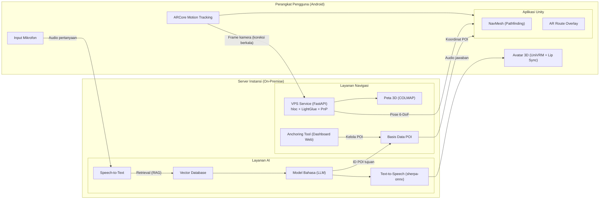
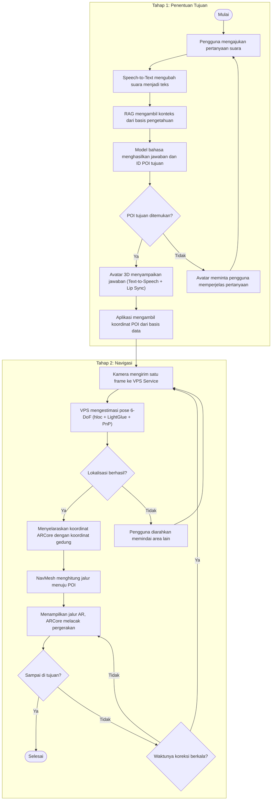

# Gambar

> 🚧 **Gambar final belum matang.** Sampai gambar final siap, diagram Mermaid di bawah dipakai sebagai
> acuan. GitHub merendernya langsung. Deskripsi lengkap dan aturan tiap gambar ada di
> `docs/pa-context.md`, bagian 11.

| Berkas (nanti) | Keterangan |
|---|---|
| `gambar-1-arsitektur.png` | Gambar 1. Arsitektur platform indoor navigation terintegrasi AI avatar assistant berbasis RAG |
| `gambar-2-alur.png` | Gambar 2. Alur pemrosesan pertanyaan pengguna hingga navigasi AR |

## Gambar 1. Arsitektur (versi Mermaid)

## Gambar 2. Alur (versi Mermaid)

## Pilihan untuk gambar final

| Pilihan | Dirender GitHub? | Bisa disunting ulang? | Cocok untuk |
|---|---|---|---|
| **Mermaid** (di atas) | ✅ langsung | ✅ teks biasa, mudah dilacak di git | Acuan hidup di repo |
| **Excalidraw, ekspor SVG atau PNG dengan opsi *embed scene*** | ✅ sebagai gambar | ✅ berkasnya bisa dibuka lagi di excalidraw.com atau ekstensi Excalidraw di VS Code | Gambar final bergaya sketsa |
| **Berkas `.excalidraw` mentah** | ❌ hanya JSON | ✅ | Tidak disarankan di repo ini |
| **draw.io, ekspor `.drawio.svg`** | ✅ sebagai gambar | ✅ | Gambar final bergaya formal untuk dokumen PA |

**Saran:** Mermaid tetap jadi acuan di repo. Untuk dokumen PA, buat gambar final dengan Excalidraw
atau draw.io, lalu ekspor SVG yang menyertakan data gambarnya supaya bisa disunting ulang. Pastikan isi
gambar final tetap sama dengan diagram Mermaid di atas.

Sebelum commit gambar apa pun, pastikan tidak ada nama server internal, alamat IP, atau data pribadi,
karena repo ini publik.
